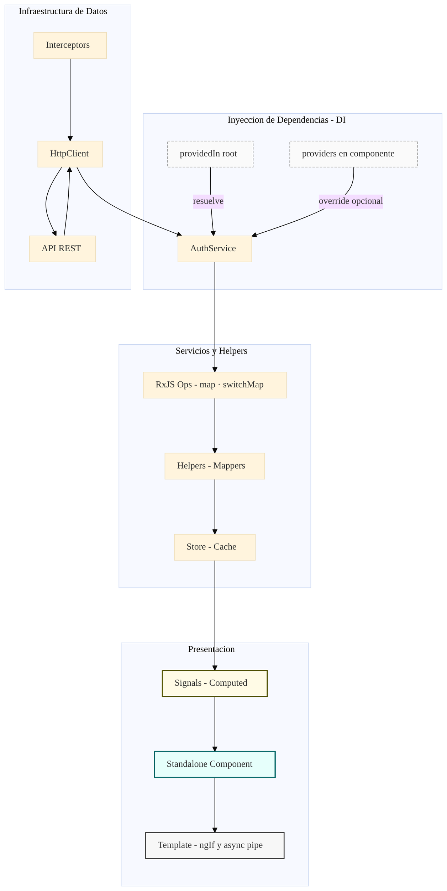

# 🧩 Anatomía del Flujo Reactivo en Angular

Material adicional para **Galaxy Trainee 2025** — Arquitectura Funcional y Reactiva (EVAAS / Liora).

---

## 1. Providers (Proveedores de Dependencias)
Los *providers* son las fuentes de inyección de dependencias que suministran servicios, librerías o configuraciones.

- Se resuelven jerárquicamente (`root`, módulo, componente).
- Permiten la asincronía (HTTP, sockets, signals).
- Se exponen mediante observables o promesas.

```ts
@Injectable({ providedIn: 'root' })
export class UserService {
  user$ = this.http.get('/api/user');
}
```

---

## 2. Standalone Components
Componentes autónomos sin `NgModule`, permiten modularidad y carga perezosa.

```ts
@Component({
  standalone: true,
  selector: 'app-dashboard',
  imports: [CommonModule, RouterModule],
  template: `<h1>Dashboard</h1>`
})
export class DashboardComponent {}
```

---

## 3. Observables
Flujos asíncronos que emiten valores en el tiempo. No ejecutan nada hasta que se suscriben.

```ts
this.userService.user$
  .pipe(map(u => u.name.toUpperCase()))
  .subscribe(console.log);
```

---

## 4. Transformadores (Operadores RxJS)
Funciones puras que modifican flujos de datos.

- Creación: `of`, `from`, `interval`
- Transformación: `map`, `switchMap`
- Filtrado: `filter`, `take`
- Combinación: `combineLatest`
- Errores: `catchError`, `retry`

---

## 5. Testigos (Observers)
Reciben los valores emitidos por los flujos.

```ts
río$.subscribe({
  next: v => console.log('Valor:', v),
  error: e => console.error('Error:', e),
  complete: () => console.log('Fin')
});
```

---

## 6. Helpers / Abstracciones
Encapsulan operaciones comunes, transforman DTOs y limpian la arquitectura.

```ts
export function mapToUser(dto: any): User {
  return { id: dto.id, name: dto.full_name };
}
```

---

## 7. Manifestación (UI / Estado Final)
El flujo se manifiesta en la interfaz, ya sea con `async pipe`, `signals` o stores.

```html
<div *ngIf="user$ | async as user">
  Bienvenido, {{ user.name }}
</div>
```

---

## 8. Diagrama técnico (flujo Angular)



---

### Resumen técnico del flujo

```
Provider → Standalone → Observable → Operadores → Observer → Helper → UI
```

---

**Material elaborado por:** ✦ *David Utreras (EVAAS / Galaxy Trainee 2025)*  
**Apoyo técnico y estructural:** GPT‑5 – Arquitectura funcional y simbólica del código.
